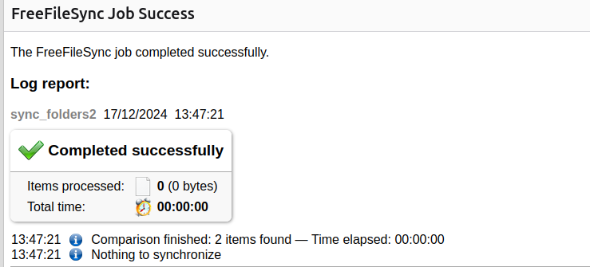

# FreeFileSync Log & Email Notifier

This repository contains a Python script (`sync_mail.py`) designed to automate **folder synchronization** using FreeFileSync and send email notifications with the synchronization log.

## Features
- **Runs FreeFileSync Batch Jobs** to synchronize two folders.
- **Generates logs** in HTML format to track changes.
- **Sends email notifications** with logs attached.
- **Compares two folders** using FreeFileSync's `.sync.ffs_db` files.

---

## Prerequisites
### Software Requirements
- Python 3.x
- FreeFileSync installed (`/usr/local/bin/FreeFileSync` expected)
- An SMTP email account for sending notifications

### Python Dependencies
Ensure you have the required Python modules installed:
```bash
pip install smtplib email
```

---

## Setup & Usage
### 1. Configure FreeFileSync
- Create a **FreeFileSync batch file** (`.ffs_batch`) with your folder synchronization settings.
- Make sure logging is enabled in FreeFileSync to generate HTML log files.

### 2. Run the Script
Execute the script manually or set up a scheduled task:
```bash
python sync_mail.py
```

### 3. How It Works
- The script runs FreeFileSync using the defined batch job.
- It retrieves the latest log file from the `Logs/` directory.
- An email is sent with the log file attached, notifying recipients of the sync status.

### 4. Email Configuration
Update the script with your SMTP credentials:
```python
from_email = "your_email@example.com"
from_email_password = "your_password"
smtp_server = "smtp.example.com"
smtp_port = 587
to_emails = ["recipient@example.com"]
cc_emails = ["cc@example.com"]
```

---

## Folder Comparison
- The script interacts with `Compare1/` and `Compare2/` folders.
- `.sync.ffs_db` files inside these folders store FreeFileSync metadata for tracking changes.

---

## Logs
- Sync logs are stored in the `Logs/` directory.
- Filenames follow this format:
  ```
  sync_folders2 YYYY-MM-DD HHMMSS.XXX.html
  ```
- These logs provide detailed reports on folder changes.

---

## Screenshot


---

## Automation
To automate the script, you can:
- Use **cron jobs** (Linux/macOS)
- Use **Task Scheduler** (Windows)

Example cron job (runs every day at midnight):
```bash
0 0 * * * /usr/bin/python3 /path/to/sync_mail.py
```
